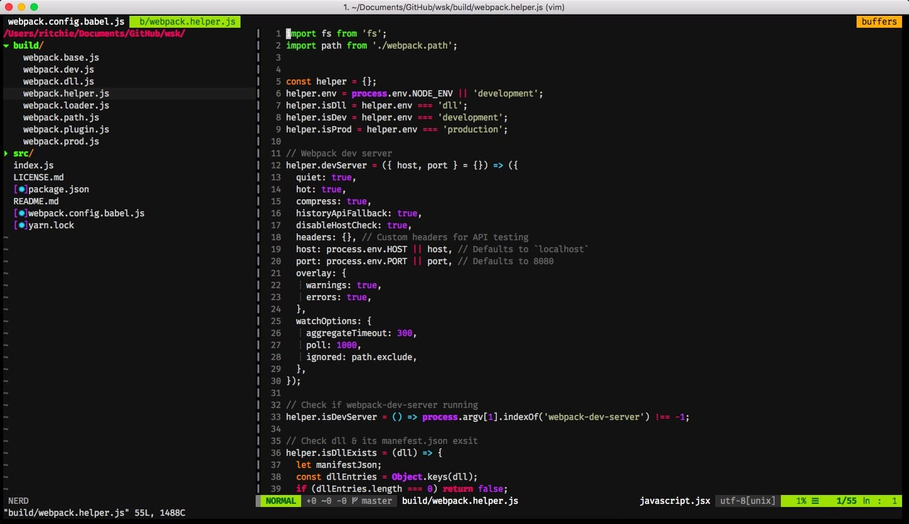

# vimrc 

*Simple vim configuration for my terminal and server*

## Screenshot

## Editorconfig

I use [editorconfig](http://editorconfig.org/) for maintaining consistent coding styles between different editors and IDEs.

## Credits

* [vim-plug](https://github.com/junegunn/vim-plug) - minimalist Vim Plugin Manager
* [vim-bootstrap](https://github.com/avelino/vim-bootstrap) - .vimrc configuration generator
* [Vim Awesome](https://vimawesome.com/) - Awesome vim plugins across the universe
